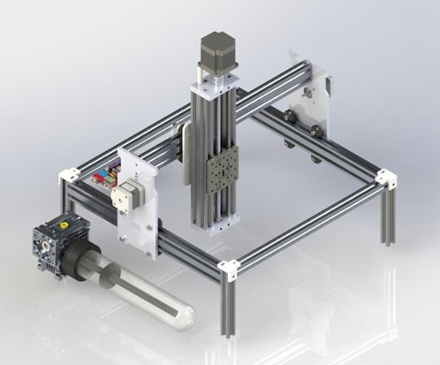
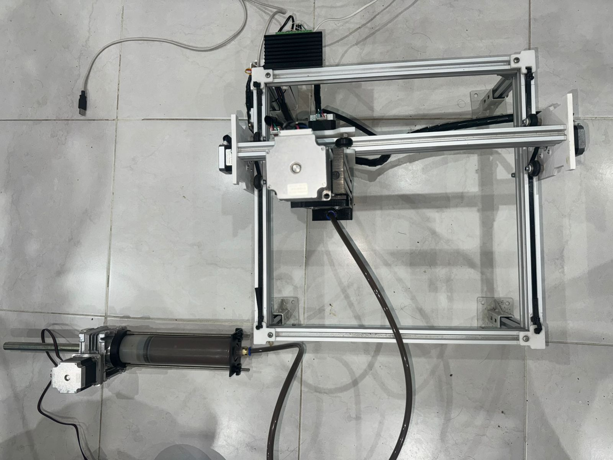
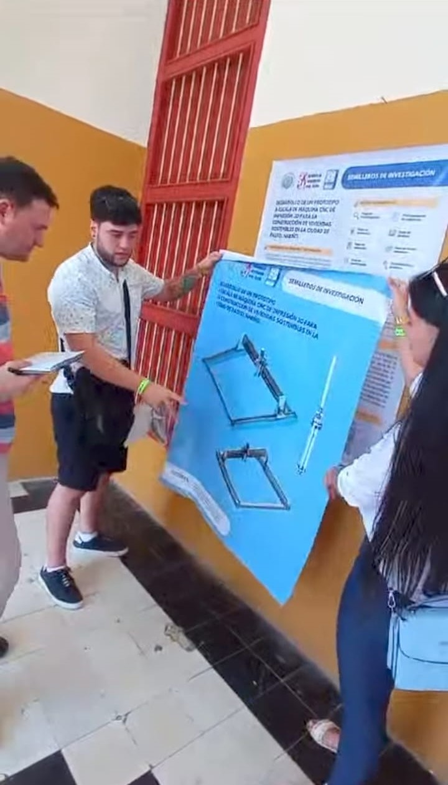

# 🏗️ CNC 3D Printer for Social Housing: Meritorious Thesis

> **Prototipo a escala de máquina CNC de impresión 3D para la construcción de viviendas sostenibles en Pasto, Nariño.**

Este repositorio documenta el diseño, construcción y validación de un sistema mecatrónico de manufactura aditiva (LDM - Liquid Deposition Modeling) enfocado en la automatización de viviendas de interés social. El proyecto integra diseño mecánico robusto, electrónica de potencia híbrida y control por software, obteniendo la distinción de **Tesis Meritoria** por la Universidad Mariana.

---

## 📸 Galería del Proyecto

### 1. Diseño vs. Realidad
El sistema fue modelado integralmente en CAD antes de su fabricación para asegurar la validación cinemática.

| **Diseño Mecánico (CAD)** | **Prototipo Físico (Implementación)** |
|:---:|:---:|
| |  |
| *Figura 1. Diseño estructural y sistema de cinemática.* | *Figura 2. Ensamble final con electrónica integrada.* |

### 2. Prueba de Funcionamiento (Demo)
Validación de extrusión de pasta (mezcla prototipo) y sincronización de ejes.

> *Figura 3. Prueba de concepto: Manufactura Aditiva por Extrusión de Pasta (LDM).*

---

## 🏆 Reconocimientos y Difusión

La calidad técnica e impacto social de este proyecto han sido validados en escenarios académicos de alto nivel:

* **🎓 Tesis Meritoria:** Máxima distinción otorgada por la Universidad Mariana.
* **🥇 Calificación SOBRESALIENTE (90/100):** Otorgada en el *XXVI Encuentro Nacional de Semilleros de Investigación RedCOLSI 2023*.
* **🗣️ Ponencia Nacional:** Proyecto seleccionado para representación en el encuentro nacional en la **Universidad de Cartagena**.

> *Figura 4. Socialización del prototipo ante pares académicos en el encuentro nacional RedCOLSI (Cartagena).*

---

## 🔩 Especificaciones Técnicas (Hardware)

El sistema utiliza una arquitectura modular diseñada para soportar cargas mecánicas y escalar a tamaños mayores.

| Subsistema | Componente | Descripción Técnica |
| :--- | :--- | :--- |
| **Estructura** | Perfilería de Aluminio (2020 / 2040 / 4080) | Bastidor de alta rigidez con perfiles 4080 en la base para estabilidad estructural. |
| **Cinemática** | Motores NEMA 23 & NEMA 17 | **NEMA 23:** Alto torque para ejes principales (X, Y, Z). **NEMA 17:** Precisión para extrusión. |
| **Drivers** | Híbrido: TB6600 + A4988 | **TB6600:** Etapa de potencia externa para motores NEMA 23. **A4988:** Control integrado en shield para NEMA 17. |
| **Control** | Arduino Mega 2560 + RAMPS 1.4 | Procesamiento de G-Code y gestión de señales. |
| **Extrusión** | Sistema de Jeringa LDM | Mecanismo de extrusión mecánica para materiales viscosos (basado en principios de Eazao). |
| **Energía** | Fuente Conmutada 12V / 24V | Alimentación separada para lógica y potencia. |

### ⚡ Diagrama de Conexiones
Esquema de la arquitectura electrónica híbrida utilizada para manejar las diferentes cargas de potencia:

> *Figura 5. Diagrama de cableado referencial. Se observa la integración de la RAMPS 1.4 con drivers externos de potencia industrial para los ejes de mayor torque.*

---

## 🛠️ Tecnologías y Herramientas

### Diseño y Modelado (CAD)

### Fabricación y Slicing

**Slic3r** (Generación de G-code especializado)
### Control y Programación

---

## 📂 Estructura del Repositorio

* `/firmware`: Código fuente para el controlador (Marlin/Arduino).
* `/hardware`:
    * `/cad`: Archivos STEP y nativos de diseño.
    * `/planos`: Planos técnicos acotados en PDF para fabricación.
    * `/schematics`: Diagramas electrónicos.
* `/docs`: Documentación académica, certificados (RedCOLSI) y manuales.
* `/media`: Banco de imágenes y videos del proyecto.

---

## 📈 Trabajo Futuro (IA & Data Engineering)
Como parte de mi formación actual en Maestría en Inteligencia Artificial (UNIR), se plantean las siguientes evoluciones para el proyecto:
1.  **Computer Vision:** Implementación de cámaras para detección de fallos de impresión en tiempo real.
2.  **Optimización:** Uso de algoritmos genéticos para optimizar las trayectorias de relleno (infill) en muros de concreto.
3.  **IoT:** Monitoreo remoto de variables de impresión.

---

## 👥 Autores y Créditos

Este proyecto fue desarrollado como tesis de grado por:

Miguel Santiago Martínez Belalcázar - Líder de proyecto, Integración de sistemas, Firmware y Diseño de UI, Diseño mecánico, Control de Potencia. https://www.linkedin.com/in/miguel-santiago-mart%C3%ADnez-belalc%C3%A1zar-19359a313/
Ximena Alejandra Rosero - Análisis estructural.
Sebastián Lagos Vidal - Cálculos Eléctricos.
Director de Tesis: PhD. Richard Geovanni Moran Perafán

**Referencias de Diseño:**
* El sistema de extrusión se desarrolló tomando como referencia los principios mecánicos de extrusores LDM comerciales (serie Eazao), adaptando la transmisión para componentes locales y mayor caudal.

---
*Proyecto desarrollado bajo el marco académico de la Universidad Mariana. Pasto, Colombia.*
